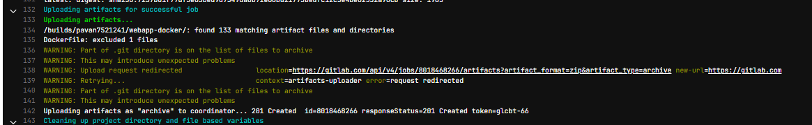
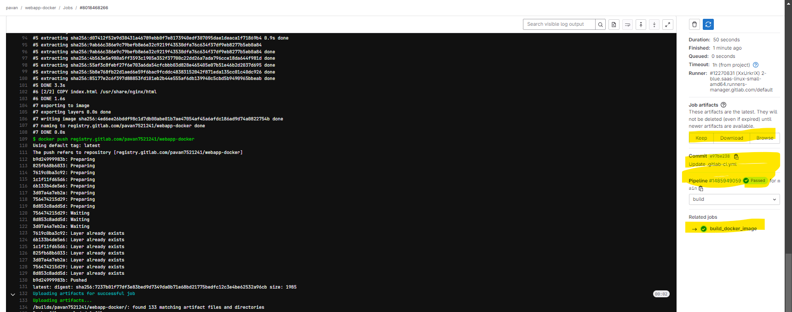

# CI Artifacts

- We can attach useful files and directories as artifacts to the job when it
succeeds, fails, or always.

-The artifacts are collected on GitLab after the job finishes.

- We can download the artifacts from the GitLab UI.

- By default, the jobs in later stages automatically fetch all the artifacts
uploaded by the jobs in earlier stages.


### Example

```
stages:
- scan
docker_scan_job:
stage : scan
script:
-
./scan.sh
artifacts:
paths:
- $CI_PROJECT_DIR/

```

### - #artifacts:exclude

```
stages:
- build
- test
docker_build_job:
stage : build
script:
- echo “Docker Build”
artifacts:
paths:
- $CI_PROJECT_DIR/
exclude:
- Dockerfile
```

### artifacts:expire_in Example

```
stages:
- scan
docker_scan_job:
stage : scan
script:
-
./scan.sh
artifacts:
paths:
- $CI_PROJECT_DIR/
expire_in: 1 week

```

- 
- 