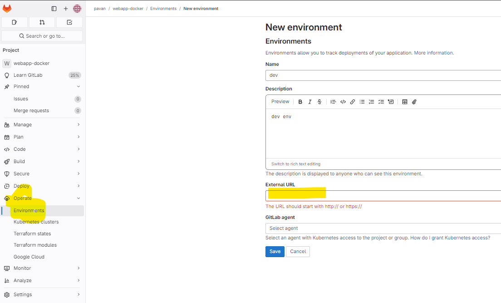

# Env

- Environments help to describe where the code will be deployed.

- Whenever GitLab CI/CD deploys a revision of code to an environment, a
deployment is created.

- GitLab provides a complete history of all the deployments for each
environment.

 ### There are two types of environments:
- Static environments: These environments have static names, like beta,
QA, or production. Normally reused by upcoming deployments.
Dynamic environments: These environments have dynamic names and
will be created dynamically by CI/CD Pipeline.

Static ENV Set up
--
- 
- If we have custom runner then we need to use http://custom-runner-ec2-ip-address, Make 80 is allowed in sg.

```
stages:
- deploy
deploy_job:
stage: deploy
script:
- echo "Deployment started"
environment:
name: dev
url: https://YOUR_DOMAIN.com

```


### Dynamic Env

```
stages:
- deploy
deploy_job:
stage: deploy
script:
- echo "Deployment started"
environment:
name: QA123
url: https://YOUR_DOMAIN.com

```

- These are created directly and we have not defined anythere in the code.