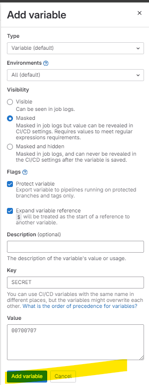
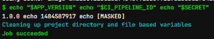

variables
--
- Variables are set globally for a project and can be accessed by jobs during pipeline execution.
- dynamically control our pipelines
- dynamically control on runtime


Variable precedence
--
- CICD variables override project-level variables, which, in turn, override gropu-level variables.


Pre-defined variables
--
- These are variables that are set by gitlab and are available for use in your ci/cd pipeline scripts without explicit definition.
- CI_JOB_NAME
- CI_PIPELINE_ID


secret variables
--
- Users with a maintainer role can add/update project cicd variables.
- select project settings -- cicd and then expand variables section 
- add variable - mask it
- 

Example
--
```
stages:
    - build

variables:
    APP_VERSION: "1.0.0"

build-job:
    stage: build

    # tags:
    #     - aws-ec2 # CUSTOM RUNNER
        
    script:
        echo "$APP_VERSION"
        echo "$CI_PIPELINE_ID"
        echo "$SECRET"
```

- 
- Secret value will not be printed.

