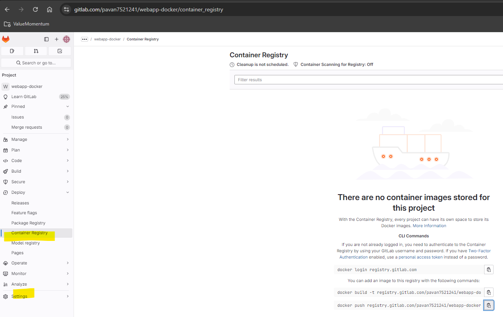

- 

- Access token
- Profile -- Access token
- settings -- cicd -- add variables
- masked -- add variable

## Update ci file 
- With auto login

```
stages:
  - build

default:
  image: docker:latest
  services: 
    - docker:dind
variables:
  DOCKER_HOST: "tcp://docker:2375"
  DOCKER_TLS_CERTDIR: ""

build_docker_image:
  stage: build
  # tags:
  #   - aws-ec2 # Custom Runner
  before_script:
    - docker version
  script:
    - echo "Building the project..."
    - docker login registry.gitlab.com -u pavan0077 -p $TOKEN 
    - docker build -t registry.gitlab.com/pavan7521241/webapp-docker .
    - docker push registry.gitlab.com/pavan7521241/webapp-docker

```