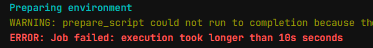
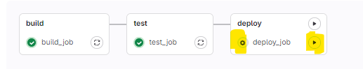
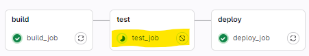

# ONLY, EXCEPT

- 2 imp keywords in GitLab CI config are only and excpet.
- These keywords help control when a job should or should not run based on specified conditions

- Only: Helps to define when a job runs
- Except : Helps to define when a job does not run.

Example
--
```
stages:
    - build
    - test

variables:
    APP_VERSION: "1.0.0"

build-job:
    stage: build
    only:
       - main # This job will run as the branch is main branch

    # tags:
    #     - aws-ec2 # CUSTOM RUNNER
        
    script:
        echo "$APP_VERSION"
        echo "$CI_PIPELINE_ID"
        echo "$SECRET"

test-job:
    stage: test
    except:
        - main # This job will not run as it main branch, That except main branch it will work on other branches.
    before_script:
        - echo "Image verfication started"
    script:
        - echo "Test completed"
```

# RULES keyword

- RULES are always evaluated in the defined order until the frist rule matches.
- Advance version of only and except
- inlcustion or exclustion in the cicd pipelines


example:
rule-check

```

stages:
    - build

docker-build-job:
    stage: build
    rules:
        - if: $CI_COMMIT_BRANCH == "main"
    script:
        - echo "Build Passed"
```

# TIMEOUT

- We can use a timeout value to configure a timeout for a specific job.
- If our job is running for longer than the timeout, the job will fail..
- we can configure the job-level timeout longer than the project-level timeout, but it cannot be longer than the runner's timeout

- possible inputs:
- 30 seconds, 10 minuts, 3h 10m

Example
--
```
image: ruby:3.1-slim

stages:
    - build

docker-build-job:
    stage: build
    rules:
        - if: $CI_COMMIT_BRANCH == "main"
    script:
        - echo "Build Passed.."
        - sleep 80
    timeout: 10s
```

- 

# WHEN keyword

- We can use when to configure the conditions like when our job will run
- on_success
- manual
- delayed
- never
- always
- on_failure

- we can use when with rules for dynamic job control 
- 


Example
--
```
stages:
  - build
  - test
  - deploy

build_job:
  stage: build
  script:
    - echo "Building the project..."

test_job:
  stage: test
  script:
    - echo "Running tests..."
  when: on_success # When build is successful then this test will run, This is the default behaviour of the gitlab

deploy_job:
  stage: deploy
  script:
    - echo "Deploying the project..."
  when: manual # this will be waiting for the approval be'coz we have added as manual we need to click on resume button to run this job.

```


# NEEDS keyword

- We can use needs to execute the jobs in any order
- We can ignore stage orders and run any random job in another stage without waiting for pervious stage jobs to get completed.
- 
- Here test job needs build_job to be successfuly executed beforing test_job runs.

Example
--
```
stages:
  - build
  - test
  - deploy

build_job:
  stage: build
  needs: []
  script:
    - echo "Building the project..."

test_job:
  stage: test
  needs: ["build_job"]
  script:
    - echo "Running tests..."

deploy_job:
  stage: deploy
  needs: []
  script:
    - echo "Deploying the project..."
```

# Includes keyword

- The include keyword is used in the .gitlab-ci.yml file to include external yaml files. This helps in modularizing the CICD configuration and reusing common settings or templates across multiple projects.

- Possible inputs:
- include:local
- include:project
- include:remote
- include: template

Example
--
```
include:
  - project: 'my-group/my-shared-configs'
    file: '/path/to/shared-config.yml'

stages:
  - build

job:
  stage: build
  script:
    - echo "Building the project"

```