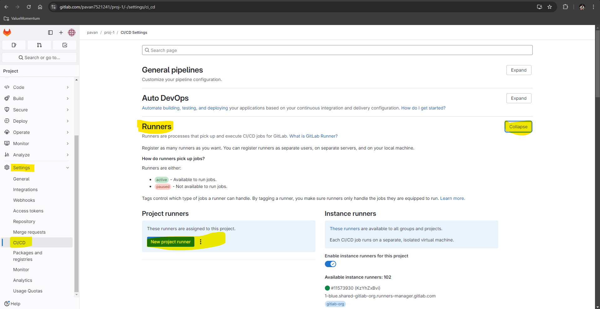
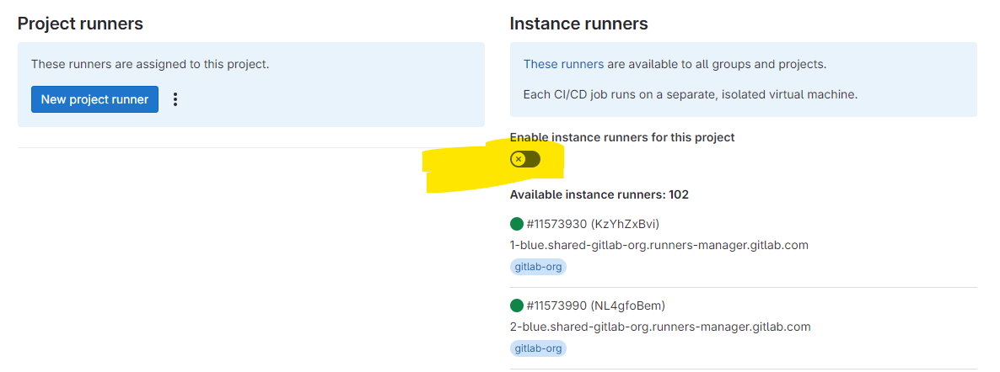
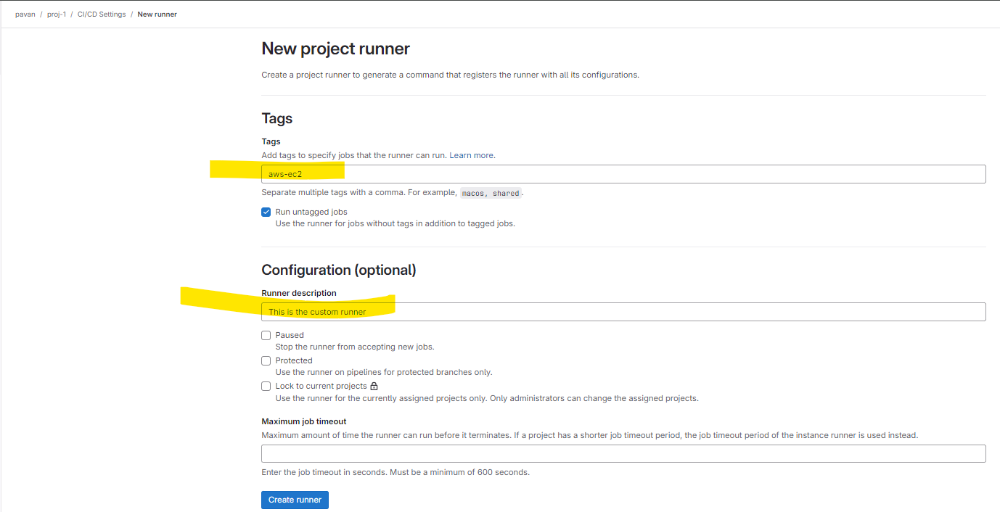
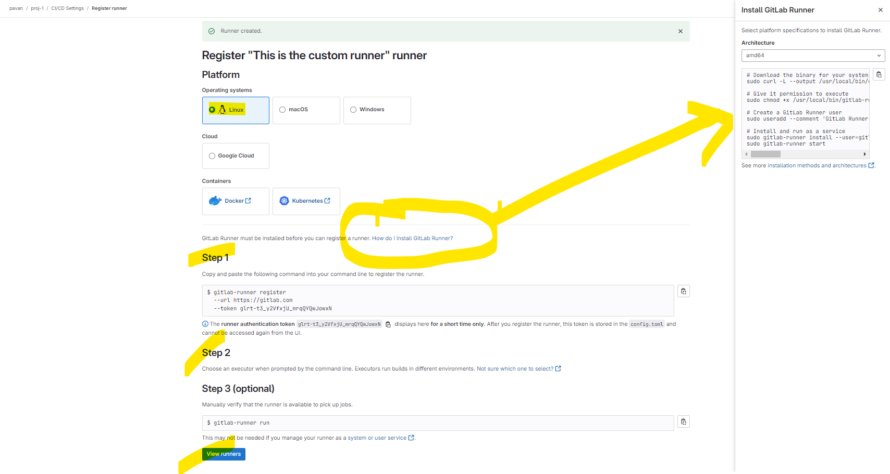
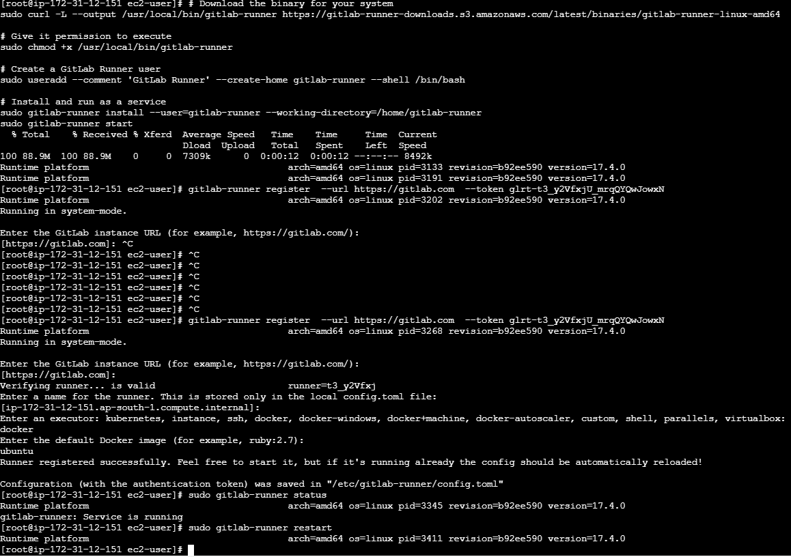
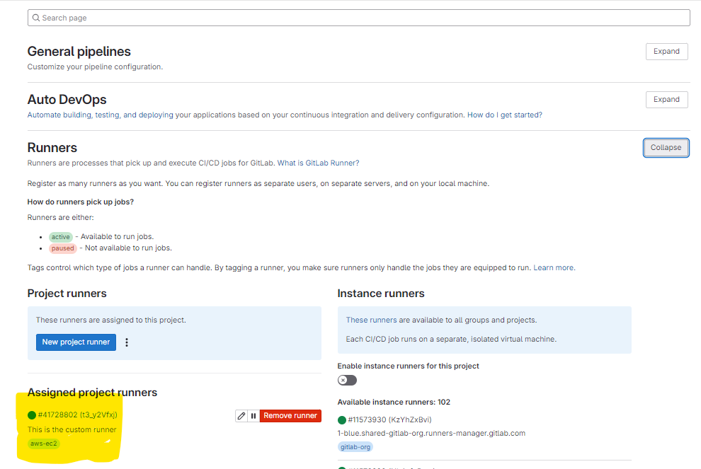
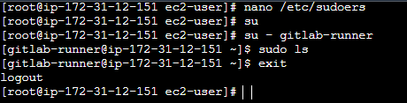
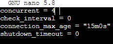
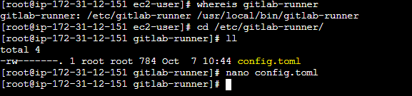

# Regisger Gitlab runner in EC2

- 
- We can try on and off shared runner 
- 
- 
- 


# install runner in ec2
- 
- 

# Add gitlab user as sudoers
- ``` nano /etc/sudoers ```
- 
- 

# Install Docker
- ``` yum -y update```
- ``` yum install docker ```
- ``` systemctl start docker ```
- ``` systemctl enable docker ```
- ``` systemctl status docker ```


# Runner concurrent limit
- 
- 

# Restart gitlab-runner
- gitlab-runner restart
- gitlab-runner status

